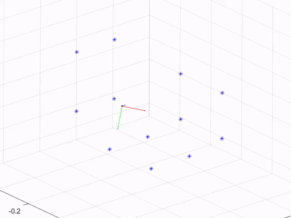

# **P**erspective-**n**-**P**oint Problem

## Description
Camera pose estimation using **D**irect **L**inear **T**ransformation (DLT), given known 2D-3D correspondences.

## Keywords
PnP, DLT

## Demo
